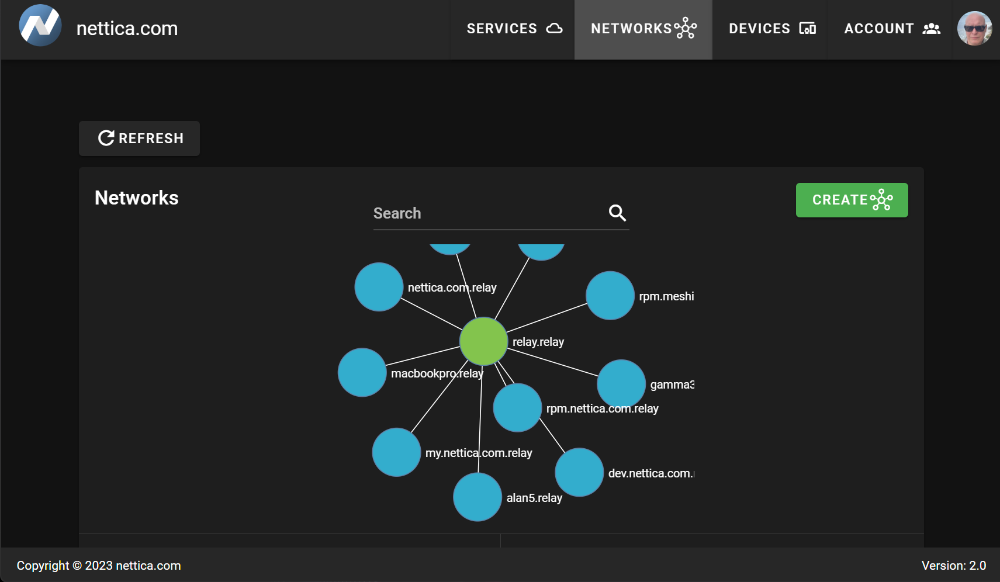

# Nettica Admin

<h1></h1>

A control plane for [WireGuard](https://wireguard.com).

## Requirements

* OIDC compliant OAuth2 implementation
* MongoDB
* Mail Server credentials for sending outgoing email
* golang
* nginx
* NodeJS / Vue 2


## Features

 * Self-hosted and web-based management of WireGuard networks
 * Networks define the configuration of the hosts in the network
 * Invite people to network with email
 * Authenticate them with OAuth2
 * Generation of configuration files on demand
 * User authentication (OAuth2 OIDC)
 * Fully configure all aspects of your VPN
 * Manage hosts remotely
 * Simple
 * Lightweight
 * Secure




## Running

### Install dependencies

Install MongoDB (Ubuntu 22.04 instructions):

```
sudo apt-get update
sudo apt-get install gnupg curl
curl -fsSL https://www.mongodb.org/static/pgp/server-8.0.asc | \
   sudo gpg -o /usr/share/keyrings/mongodb-server-8.0.gpg \
   --dearmor
echo "deb [ arch=amd64,arm64 signed-by=/usr/share/keyrings/mongodb-server-8.0.gpg ] https://repo.mongodb.org/apt/ubuntu jammy/mongodb-org/8.0 multiverse" | sudo tee /etc/apt/sources.list.d/mongodb-org-8.0.list
sudo apt-get update
sudo apt-get install -y mongodb-org

sudo systemctl daemon-reload
sudo systemctl start mongod
sudo systemctl enable mongod

```


[Download and Install Golang](https://go.dev/dl/)

Install nginx:
```
sudo apt install nginx
sudo apt install certbot
sudo apt install python3-certbot-nginx

sudo systemctl enable nginx
sudo systemctl start nginx

```

Sample NGINX Config:

```
server {

        server_name nettica.example.com;

        root /usr/share/nettica-admin/ui/dist; index index.html; location / {
            try_files $uri $uri/ /index.html;
       }

    location /api/ {
        # app2 reverse proxy settings follow
        proxy_set_header X-Real-IP $remote_addr;
        proxy_set_header Host localhost;
        proxy_set_header X-Forwarded-For $proxy_add_x_forwarded_for;
        proxy_pass http://127.0.0.1:8080;
    }
}

```

Example `.env` file:

```
SERVER=https://nettica.example.com

# IP address to listen to
LISTEN_ADDR=0.0.0.0
# port to bind
PORT=8080
# Gin framework release mode
GIN_MODE=release

# SMTP settings to send email to clients
SMTP_HOST=smtp.sendgrid.net
SMTP_PORT=587
SMTP_USERNAME=apikey
SMTP_PASSWORD=...
SMTP_FROM=Nettica <info@nettica.example.com>

# MONGO settings
MONGODB_CONNECTION_STRING=mongodb://127.0.0.1:27017

# Google Workspaces example
#OAUTH2_PROVIDER_NAME=google
#OAUTH2_PROVIDER=https://accounts.google.com
#OAUTH2_PROVIDER_URL=accounts.google.com
#OAUTH2_CLIENT_ID=...
#OAUTH2_CLIENT_SECRET=...
#OAUTH2_REDIRECT_URL=https://nettica.example.com
#OAUTH2_LOGOUT_URL=https://www.google.com/accounts/Logout
#OAUTH2_AGENT_PROVIDER=https://accounts.google.com
#OAUTH2_AGENT_CLIENT_ID=same....
#OAUTH2_AGENT_CLIENT_SECRET=same...
#OAUTH2_AGENT_REDIRECT_URL=com.nettica.agent://callback/agent
#OAUTH2_AGENT_LOGOUT_URL=https://www.google.com/accounts/Logout

# Micrsoft Entra ID example
#OAUTH2_PROVIDER_NAME=microsoft2
#OAUTH2_PROVIDER=https://login.microsoftonline.com/common/v2.0
#OAUTH2_CLIENT_ID=...
#OAUTH2_CLIENT_SECRET=...
#OAUTH2_REDIRECT_URL=https://nettica.example.com
#OAUTH2_TENET=...
#OAUTH2_LOGOUT_URL=https://login.microsoftonline.com/{tenet}/oauth2/v2.0/logout
#OAUTH2_AGENT_PROVIDER=https://login.microsoftonline.com/common/v2.0
#OAUTH2_AGENT_CLIENT_ID=...
#OAUTH2_AGENT_CLIENT_SECRET=...
#OAUTH2_AGENT_REDIRECT_URL=https://nettica.example.com
#OAUTH2_AGENT_LOGOUT_URL=https://login.microsoftonline.com/{tenet}/oauth2/v2.0/logout


# valid settings: oauth2oidc, google, microsoft2, basic, fake

# Basic auth is a first class citizen compatible with all the apps.  Login with the shadow file defined username/pass.
# If the SERVER variable above is set to, for example, nettica.example.com, it will log you in as user@example.com,
# removing the first label.  During login if you add a domain, such as user@example2.com, it will remove that
# domain to validate the user, but preserve it for user creation, allowing for easy testing and evaluation of the product.

# Basic auth requires these two variables set:
OAUTH2_AGENT_REDIRECT_URL=com.nettica.agent://callback/agent
OAUTH2_PROVIDER_NAME=basic

```

Create a systemd service for the API:

```
cat  /lib/systemd/system/nettica-api.service
[Unit]
Description=Nettica API
ConditionPathExists=/usr/share/nettica-admin/cmd/nettica-api
After=network.target

[Service]
Type=simple
User=root
Group=root
LimitNOFILE=1024000

Restart=on-failure
RestartSec=10
#startLimitIntervalSec=60

WorkingDirectory=/usr/share/nettica-admin/
ExecStart=/usr/share/nettica-admin/cmd/nettica-api/nettica-api

# make sure log directory exists and owned by syslog
PermissionsStartOnly=true
StandardOutput=syslog
StandardError=syslog
SyslogIdentifier=nettica-api

[Install]
WantedBy=multi-user.target
```

Build the API
```
cd /usr/share/nettica-admin/cmd/nettica-api
go build
```

Enable the service:

```
sudo systemctl enable nettica-api
sudo systemctl start nettica-api
```

Install NodeJS using NVM
```
wget -qO- https://raw.githubusercontent.com/nvm-sh/nvm/v0.40.2/install.sh | bash
nvm install 18
nvm use 18
```

Build the frontend

```
cd /usr/share/nettica-admin/ui
npm install
npm run build
```

With the given nginx config, you should now be able to use your website.  Don't forget
to get a cert using certbot

Run Certbot
```
sudo certbot
```


## Need Help

mailto:support@nettica.com

## License
* Released under MIT License

WireGuard® is a registered trademark of Jason A. Donenfeld.
